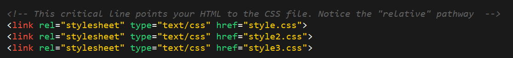

** Then Slack out the following activity:

* **Instructions:**

  * For the next 10 minutes, take a website that you yourself worked on (ex: In-Class activities, homework assignments, etc.), and utilize the Chrome Developer Tools to help you test changes in real-time.

    

  * Note: Focus on getting more comfortable using the Developer Tools. Trust us. You will WANT to use these Developer Tools as you proceed in this course.
