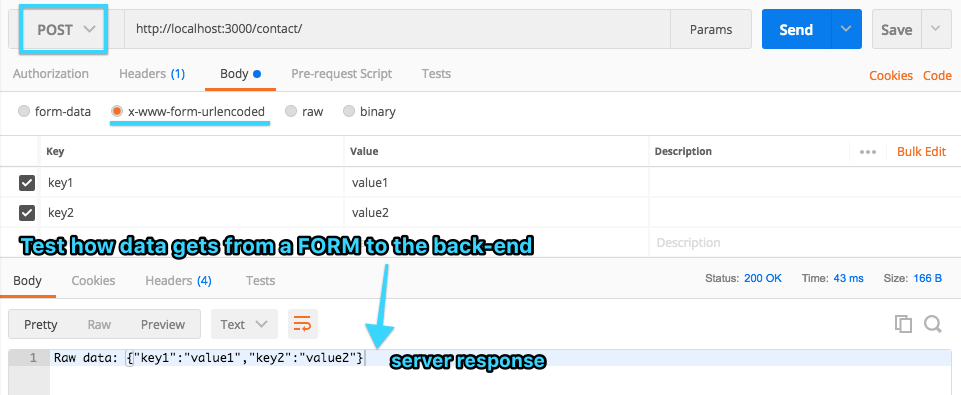
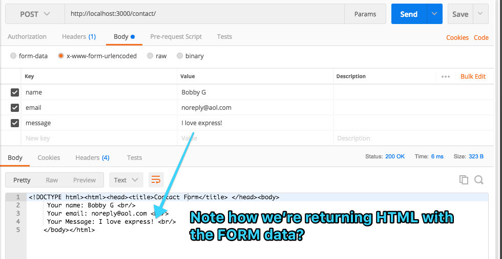

# Express Contact Form

## Prerequisites
1. Make sure you install all of the requirements inside of `package.json` - (Hint: `npm ????`)
2. Start up the `NodeJS` server (Hint: `nodemon ???.js`) 

## Back-end
1. Use postman to test the `post` route for the contact form.
2. Create a `post` test using postman
  
3. **NOW** Edit the `server.js` to capture the variables and return the ES6 template string formatted response. 

## Front end
1. Your back-end should be returning HTML: 
2. Now, edit the index.html form values to provide the data in the same way as we used POSTMAN (hint: `name`)
3. You now have a fully functioning full-stack contact form, using the basics of HTML forms and the browser! Well done!

## Bonus

* Validate the email on the server side. 
* Find a way to send an email with the contact info
* Use jQuery.ajax to `hijack` the FORM, and submit it without using the browser's default